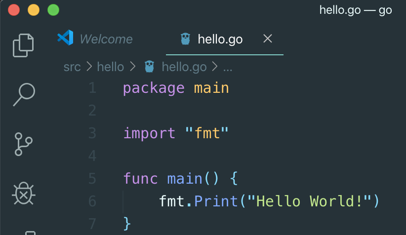
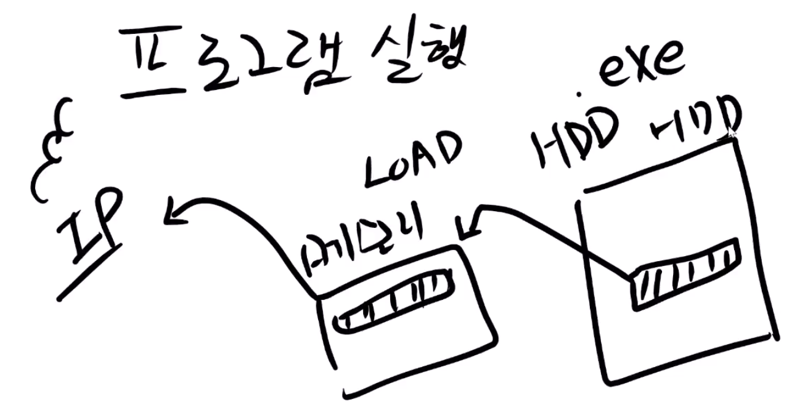
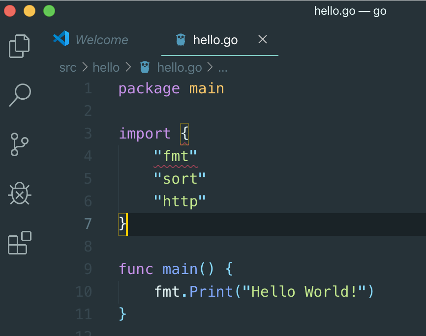
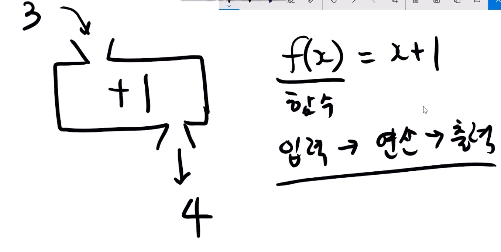
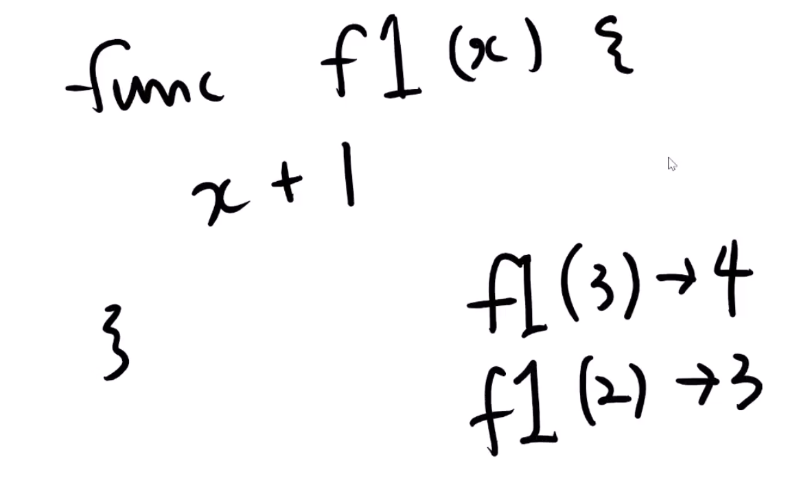
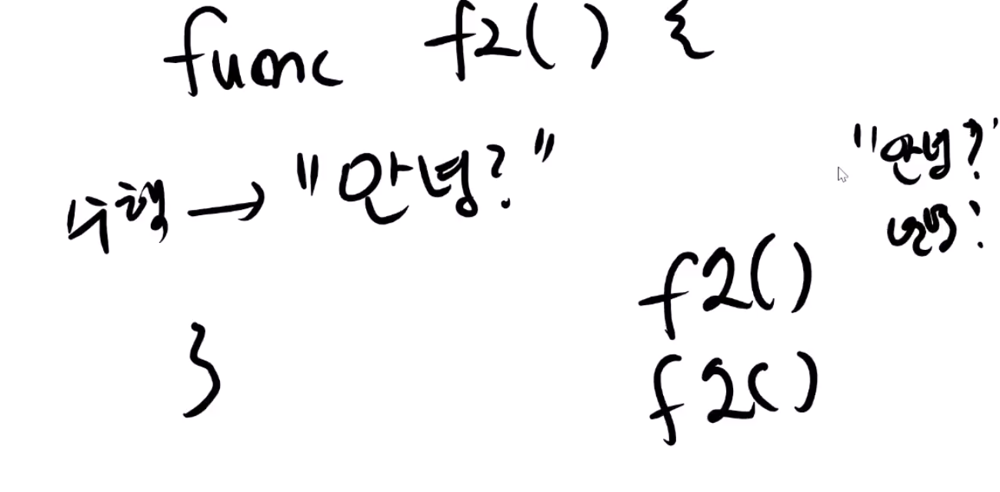

# 2. Hello World! 설명

## package main

* 라이브러리, 모듈, 패키지, 프레임워크, 엔
*  라이브러리\(도서관\)
  * 책\(지식\)
  * 상품, 즉 참고지식을 모아놓은 
  * 프로그램을 만들 때 필요한 기능을 모두 묶어놓은것
* 모듈
  * 기능을 묶어 놓은 것은 마찬가지지만, 입력 모듈 등 특정한 기능만 묶어놓은 것
* 패키지
  * 역시 기능을 묶어 놓은 것
* 프레임워크
  * 기능을 묶어 놓은 것은 마찬가지나, 절차가 필요함\(메뉴얼이 있음\)
* 엔진
  * ex\) 유니티 엔진, 언리얼 엔진
  * 기능의 묶음 뿐만 아니라, 프로그램 툴을 모두 묶어놓은 

* package main

  * go lang 에선 맨 앞줄에는 패키지에 대한 선언이 항상 필요하다
  * 여기선 main 은 약속된 말인데, 프로그램의 시작점을 포함한 것이다
  * 프로그램 실행 과정
  *  
  * HDD 에 .exe 라는 파일이 있고 클릭했을 때 메모리에 복사되는\(LOAD\) 과정이 필요하고 그 다음 CPU 는 Instruction Pointer\(IP\)를 표시해야하는데, 첫 시작이 어디서 부터시작하는 지 표시하는 것이다. 그 다음 한줄씩 한줄씩 실행해나감
  * 따라서 IP 를 알 수 없으므로 프로그램에서 알려줘야 한

* import "fmt"
  * import: 앞에서 선언했던 package 를 가져오는데, package 는 fmt 를 가지고 있
  *  fmt stands for "format" 즉 표준패키지 중 하나가 fmt 이다
  * go 에서 제공하는 표준패키지가 fmt 이
  *  외부패키지는 여려 종류가 있
  *   여러개를 가져올 때 { }

* func main\(\) {
  * func 
    * 함수
    *  
    *  
    *  
    * main 함수는 IP 즉, 시작점을 의미한다

* fmt.Println\("Hello World!"\)
  * . 은 fmt 라는 패키지 안에 있는 Println 이라는 함수를 불러 오는 것
  *  \( \) 소괄호 사이에 있는 것이 입

