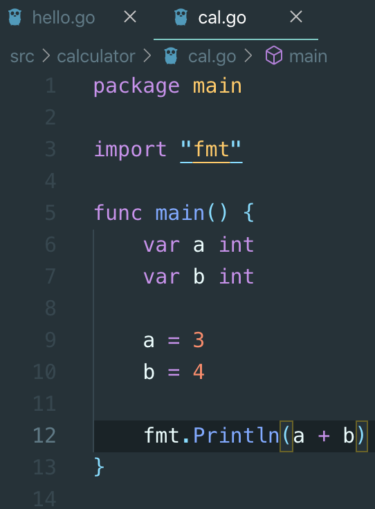
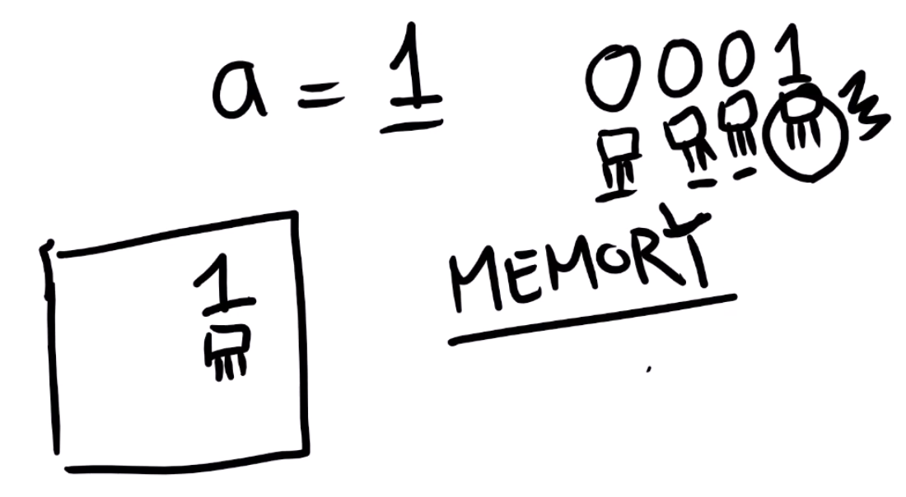
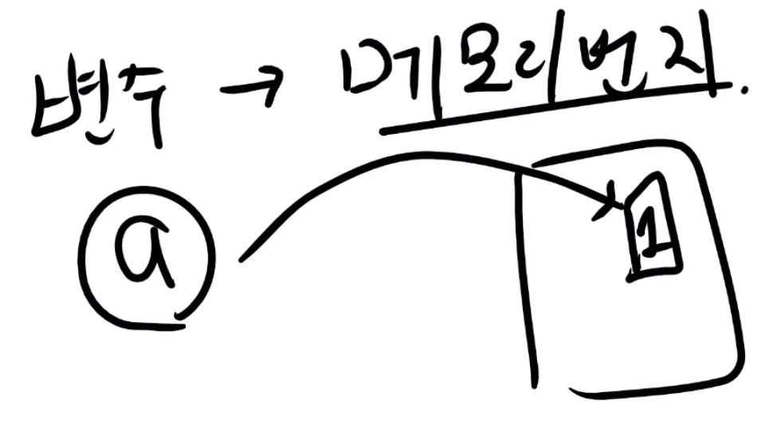

# 3. 변수

## 변수의 속성

* 이름\(a, b\)
* 값\(3, 4\)
* Type
  * 정수, 실수, 문자열 등 자기가 가진 타입만 대입할 수 있

## 선언 및 대입

* 선언
  * var a int
* 대입
  * a = 3
  * a는 정수형이기 때문에, 실수형이나 문자열을 대입할 수 없다

## 컴퓨터는 어떻게 구현하는가?

* 폰 노이만 구조에서 변수 a = 3 이라하면, 이 값을 저장할 곳이 필요하다
* 만약 a = 1 이라는 얘기는 2진수로 표현하
  *  0001 이다 \(숫자 각각은 트랜지스터 하나씩\)
  * 즉 컴퓨터 어딘가에는 모두 꺼져있고 딱 하나 불이 켜져있는 것이 있다
  *  
  * 이는 **메모리에 저장**되어 있는데, 메모리에서 값을 가져와서 캐시에 가져다 놓고 캐시에서 다시 레지스터로 가져와 레지스터에서 연산을 한다
* 즉 a = 1 이라는 것은 "메모리 상 어떤 부분에 값이 쓰일 것이다" 라고 생각하면 된다
  * 어떤 부분에 쓰일 지는 알 수 없지만, 가리키는 번지 수가 있는데, 즉 모든 변수는 메모리 번지를 가지고 있
  *    
* 변수는 메모리 주소와 함께 '사이즈'를 가지고 있는데, 만약 메모리 번지가 326이고,  사이즈가 4이면 메모리 끝점은 메모리 번지 + 메모리 사이즈 = 330을 알 수 있다

## 변수의 속성

* 이름
* 값
* 타
  *  사이즈를 포함한 타입이 있다
  * int: 정수타입
    * 단위사이즈: 32bit / 64bit
    * 연산의 기본사이즈가 32bit\(4 byte\) 인지 64bit\(8 byte\) 인
    * 즉 int 는 컴퓨터에 따라 다르다. 4 byte 인지 8 byte 인
    *  int32 는 4byte 짜리 정수 타입 int64 는 8byte 짜리 정수 타
  * float: 실수형 타
    *  float32, float64
  * bool: 사이즈가 결정되어 있지 않
    * true/false
  * string: 
    * 사이즈가 결정되어 있지 않음
* 메모리 주
*  사이즈

