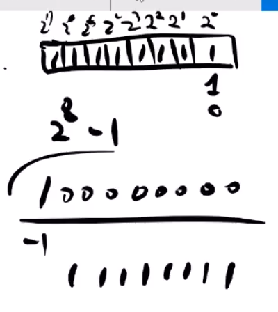

# 4. 변수 \(2\)

## 변수의 속성

* 이름
* 값
* 타입
* 메모리 주소
* 사이즈

## 변수: 값을 담을 수 있는 그릇

* 그릇의 크기가 달라지면 값을 담을 수 있는 범위가 달라진다
  * 그릇의 크기: 타입의 사이즈

## 정수형 타입

* int8
  * 8bit
  * 1 byte: 256
  * -128 ~ 127
  * uint8: 0 ~ 255
* int16
  * 16bit
  * 2 byte: 65536개
  * -32768 ~ 32767
  * uint16: 0 ~ 65535
* int32
  * 32bit
  * 4 byte: 42억
  * -21억 ~ 21
  * uint32: 0 ~ 42
* int64
  * 64bit
  * 8 byte
  * 값은 많이크
*  
  * 8bit 는 칸이 8개이고 각 칸에는 1 또는 0이 들어갈 수 있다
    * 가장 큰 수는 모두 1이 들어가는 수인데, 이는 2⁸ 이고, 거기서 1을 뺀
      *  2⁸ - 1 = 255
      * 255 + 0을 포함하면 = 256개의 숫자를 표현할 수 있다

## 실수형 타

* 323.5678
  * 3235678 \* 10⁻⁴
* 10000000000
  * 1 \* 10^10 
* 실수형: 정부분 + 지수부분
  * 3.1415 = 31415 \* 10^-4
  * 정수부: 31415, 실수부:-4 
* float 32
  * 4byte
  * 정밀도: 숫자부분 7개까지 표현가능
  * 3.14151678 이 있으면 
  * 3141516 까지 표현가능 따라서, 3141516 \* 10^-6
* float 64

  * 8byte
  * 정밀도: 숫자부분 65개까지 표현가

### 메모리를 아끼기 위해서 무조건 큰 그릇을 쓰는 것은 좋지 않다

## 문자열 타입

* 문자열 사이즈는 문자열 길이에 따라 다르다
* 일반적인 영문자는 1byte
* "abc"
  * 3 byte 
* 각 글자들이 모여있는 것인데,
  * 각 글자를 rune 이라하고 string 은 rune 의 모임이다

