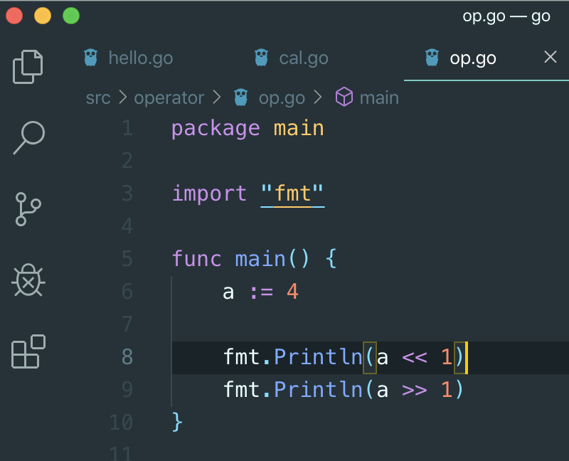

# 5. 연산자

## 연산자

* 산술연산자
  * + - \* /
* 비트연산자
  * & \| ^ 
  *  
  *  
* 논리연산자 \(비교연산자\)
  * &lt; &gt; == != &lt;= &gt;= && \|\| !
* 그

## a := 4

* var a int
* a = 4
* 이렇게 두 줄짜리 코드
*  a := 4 로 할 수 있
*  변수 선언에는 여러가지 방법들이 있

* fmt.Printf\(~~~\)
  * % 안에 대입을 시켜라는 의
  *  %v 는 , 다음에 오는 타입에 맞게 잘 넣어라는 
  * 

* a^b
  * XOR
* ^a
  * NOT

## 각 자리수를 뽑는 방

* a &^ a
  * if a := 4, \(0100\)
  * ^a = \(1011\)
  * then, 
  * 0100 &
  * 1011
  * ----–----–--
  * 0000
  * 0
* shift
  * &gt;&gt; &lt;&lt;
  * if a = 4 \(0100\)
  * a &lt;&lt; 1
    * 한 비트 왼쪽으로 밀어라
  * then,
    * 1000
  * a &gt;&gt; 1 
    * 0010

* shift 연산이 곱하기나 나누기 보다 빠르기 때문에
  * 4 \* 2 보다
  * 4 &lt;&lt; 1 가 더 빠름
  * 단 shift 는 2 곱하기나 나누기 밖에 안됨

* a += 2
  * a = a + 2

* ++
* --–

