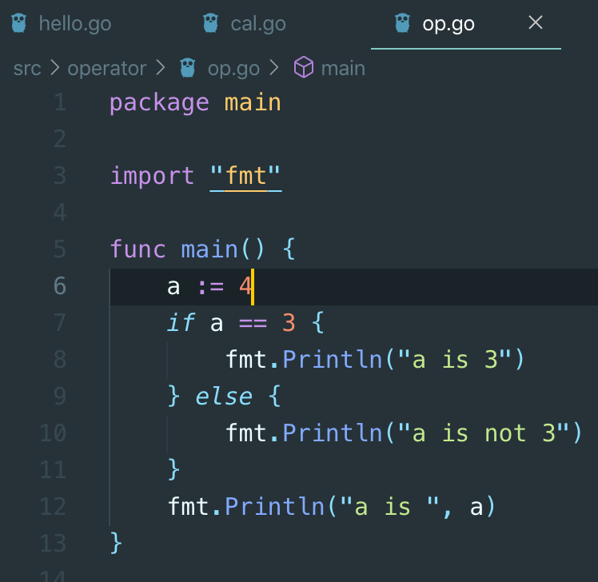
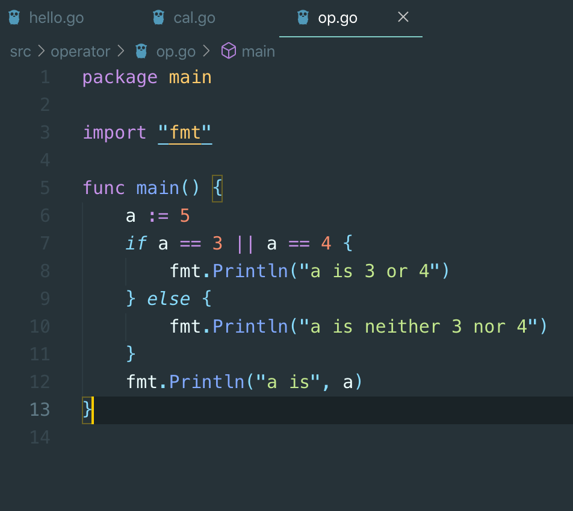
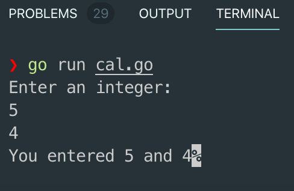

# 6. 조건연산자와 조건문

* 조건연산자는 
  * true/false
* var a bool
  * a 의 값은 true/false 만 가능. 왜냐하면 boolean 이기 때문
* 만약 var a bool 에
  *  a = 3 &gt; 4
  * 라면, a 의 값은 false


## 조건문








```go
package main

import (
	"bufio" // 한 줄을 입력받을 때
	"fmt"
	"os"      // 표준입력에서 입력을 받아야하기 때문에
	"strconv" // 문자열을 숫자열로 바꿔주는 기능
	"strings" // string 에서 찌꺼기를 제거
)

func main() {
	fmt.Println("Enter an integer: ")
	reader := bufio.NewReader(os.Stdin)

	// 한 줄을 띄우기 전까지 읽음
	// _ 는 이름없는 변수 (처리하지 않음)
	line, _ := reader.ReadString('\n')

	// 읽어들일 때 \n 과 같이 찌꺼기 값이 있으므로 이를 제거해야한다
	line = strings.TrimSpace(line)

	// 문자열을 숫자로 바꾸기
	n1, _ := strconv.Atoi(line)

	line, _ = reader.ReadString('\n')
	line = strings.TrimSpace(line)

	n2, _ := strconv.Atoi(line)
	fmt.Printf("You entered %d and %d", n1, n2)
}

```




```go
package main

import (
	"bufio" // 한 줄을 입력받을 때
	"fmt"
	"os"      // 표준입력에서 입력을 받아야하기 때문에
	"strconv" // 문자열을 숫자열로 바꿔주는 기능
	"strings" // string 에서 찌꺼기를 제거
)

func main() {
	fmt.Println("Enter an integer: ")
	reader := bufio.NewReader(os.Stdin)

	// 한 줄을 띄우기 전까지 읽음
	// _ 는 이름없는 변수 (처리하지 않음)
	line, _ := reader.ReadString('\n')

	// 읽어들일 때 \n 과 같이 찌꺼기 값이 있으므로 이를 제거해야한다
	line = strings.TrimSpace(line)

	// 문자열을 숫자로 바꾸기
	n1, _ := strconv.Atoi(line)

	line, _ = reader.ReadString('\n')
	line = strings.TrimSpace(line)

	n2, _ := strconv.Atoi(line)
	fmt.Printf("You entered %d and %d. ", n1, n2)

	fmt.Println("Enter an operator: ")
	line, _ = reader.ReadString('\n')
	line = strings.TrimSpace(line)

	if line == "+" {
		fmt.Printf("%d + %d = %d", n1, n2, n1+n2)
	} else if line == "-" {
		fmt.Printf("%d - %d = %d", n1, n2, n1-n2)
	} else if line == "*" {
		fmt.Printf("%d * %d = %d", n1, n2, n1*n2)
	} else if line == "/" {
		fmt.Printf("%d / %d = %d", n1, n2, n1/n2)
	} else {
		fmt.Println("You input wrong")
	}
}

```


